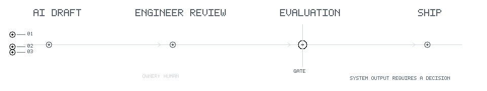

# Muhammad Abdiel Al Hafiz

**AI Project Manager. AI/ML engineer by training.**

I build the system around AI output: who owns it, how it is evaluated, where a human reviews it, and what is allowed to ship.

`AI draft → engineer review → evaluation gate → human decision → ship`

AI makes output cheap. The work is deciding what deserves to survive.

<picture>
  <source media="(max-width: 600px) and (prefers-color-scheme: dark)" srcset="./assets/github-readme/evaluation-loop-mobile-dark.gif">
  <source media="(max-width: 600px)" srcset="./assets/github-readme/evaluation-loop-mobile-light.gif">
  <source media="(prefers-color-scheme: dark)" srcset="./assets/github-readme/evaluation-loop-dark.gif">
  
</picture>

## Selected evidence

### When two LLM judges disagreed

Could an LLM score IELTS-like essays consistently enough to support human graders?

I tested 150 essays with GPT-oss-120b and Qwen3-32b, using five independent scoring runs per essay. GPT reached an ICC of 0.943. Qwen reached 0.844, scored 74 of 95 matched essays higher, and sent 92.2% of outputs to human review.

The result was not a winning model. It was a deployment rule: do not mix models within one cohort, and route unstable judgments to a person.

[Research repository](https://github.com/dlzcods/llm-awe-reliability-fairness) · [Visual report](https://dlzcods.github.io/llm-awe-reliability-fairness/scrolly-report.html)

### Know Your Sight

Jaya Koding built a browser-based screening prototype for four retinal-image classes. I owned the model work, fine tuned EfficientNetB0, evaluated it per class, and integrated it with the team's product.

The model reached 90.64% held-out accuracy across 844 images. Glaucoma recall was 80.33%, below the other three classes. That gap mattered more than another screenshot of the average.

The project placed first at INVFEST X ISF 9.0 and second at PROXOCORIS International 2025. It is competition proof, not a claim of clinical validation.

[Repository](https://github.com/dlzcods/eye-disease-classification) · [Live product](https://know-your-sight.vercel.app/) · [Notebook](https://github.com/dlzcods/eye-disease-classification/blob/main/notebook/eye_diseases_classification_4x.ipynb)

### Explainability beyond accuracy

A correct prediction can still be correct for the wrong reason.

I used Grad-CAM to inspect which regions influenced an Alzheimer's classification model. The heatmap did not make the model automatically trustworthy. It made the model easier to question.

[Research note](https://dev.to/dlzcods/how-grad-cam-helped-me-explain-alzheimers-predictions-14n3) · [Notebook](https://www.kaggle.com/code/hafizabdiel/alzheimer-classification-with-swin-efficient-net)

## Private delivery

Some of my most useful work cannot live in a public repository.

That includes Indonesian legal RAG with query reformulation, fine tuned PaddleOCR for low-quality legal documents, and deterministic extraction pipelines where low-confidence fields go to human review. One client needed auditability more than generative flexibility, so GenAI was deliberately left out.

Private code is not an excuse for public overclaiming.

## How I work

1. **No unmeasured claims.** Every AI feature needs an evaluation that matches the cost of its failure.
2. **Human ownership is explicit.** A model may produce the output, but a named person owns the decision.
3. **The architecture follows the risk.** Sometimes the right AI system deliberately excludes GenAI.

## Current focus

- Designing evaluation systems for LLM and RAG workflows
- Running AI-assisted development with explicit review gates
- Building deterministic extraction and human-in-the-loop pipelines
- Translating model behavior into product and delivery decisions

## Field proof

Two years building AI systems. Work delivered for clients in Singapore and Australia. Three competition placements with Jaya Koding. Invited to speak at Indonesian universities about how these systems are actually built.

## Contact

[Portfolio](https://hafizabdiel.framer.website/) · [LinkedIn](https://www.linkedin.com/in/muhammad-abdiel-al-hafiz/) · [Email](mailto:hafd324@gmail.com)
